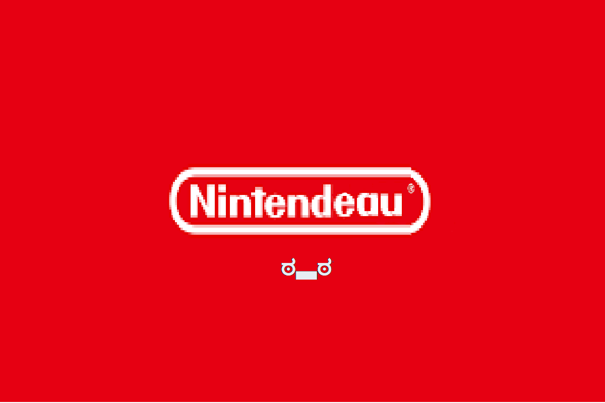
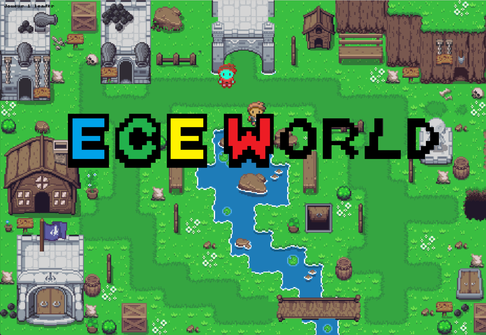

<script type="module">
  import mermaid from 'https://cdn.jsdelivr.net/npm/mermaid@10/dist/mermaid.esm.min.mjs';
    mermaid.initialize({ 
        startOnLoad: true,
        theme: 'base',
    });
</script>

<!--
# Style lead only for this slide
_class: lead
_footer: Algorithmique Avancée et Bibliothèque Graphique - 2022-2023
-->


**ING1** Projet d'informatique


# ECE World

Nintendeau

---

# Equipe Nintendeau



- DALLE Léon
- DE VULPIAN Alfred
- INNOCENT Mathéo
- DEROUICH Shaïma

---

# ECE World



## Thème

- Fête foraine (médieval et + encore)
- 9 jeux 
- 2 joueurs 
- 1 classement
- 5 tickets par joueur
---

# Carte `1/2`

*Réalisée par : **Léon**, **Alfred**.*

Décrire ici les fonctionnalités implémentées : choix joueurs, saisie des noms, affichage des scores/classement... Comment avez-vous fait ? Quels étaient les problèmes rencontrés.

---

# Carte `2/2`

Suite si ça ne tient pas sur une slide. 

:bulb: *Vous pouvez faire comme ça à chaque fois qu'une slide ne suffit pas, il vaut mieux 5 slides légères qu'une surchargée.*

---

# Organisation des jeux

Les jeux ont tous été enregistrés dans un dossier specialement créé pour eux nommé attractions. Chaque jeu est dans un fichier séparé où l'on retrouve les fonctions principales du jeu, les assets et les CMAKE.

Les jeux prennent en parametres le solde de tickets de chaque joueur, les scores et les choix faits au debut de chaque partie.

Pour lancer un jeu, il suffit de diriger son personnage vers l'une des nombreuses maisons presentes sur la carte, les regles seront affichées et il suffira de cliquer sur la barre espace pour executer le jeu.


---


# GUITAR HERO

*Réalisé par : **Alfred** (100%)*

- Il y'a 4 touches (D, F, J, K) qui correspondent aux 4 cordes de la guitare.
- Les notes tombent du haut de l'écran vers le bas.
- Le joueur doit appuyer sur la touche correspondant à la note au bon moment.
- Si le joueur appuie sur la touche au bon moment, il gagne un point.
- Si le joueur appuie sur la touche au mauvais moment, il perd et donne la main au joueur suivant.

<sup>:bulb: Remplacez les images par des captures d'écran de votre jeu.</sup>

---


# GUITAR HERO


### Structures

- `struct Note`
    - `int x`
    - `int y`
    - `int vitesse`
    - `int touche`
    - `int estAppuyee`
    - `int estAffichee`

---


### Fonctions

- `void initialiserNotes()`
- `void afficherNotes()`
- `void detecterAppuiTouche()`
- `void afficherScore()`
- `void afficherGagnant()`


### Tableaux

- `struct Note notes[20]`


---


# GUITAR HERO

### Graphe d'appel

<br>

<div class="mermaid">
%%{init: {'theme':'neutral'}}%%
flowchart LR
    GuitarHero --> initialiserNotes
    GuitarHero --> afficherNotes
    GuitarHero --> detecterAppuiTouche
    GuitarHero --> afficherScore
    GuitarHero --> afficherGagnant
</div>


---


# GUITAR HERO

### Logigramme


---


# Paris hippiques 

*Réalisé par : **Shaïma** (100%)*

-Le jeu se joue à deux joueurs.
-Il y a 5 tickets par joueur.
-Les 2 joueurs choisissent un cheval chacun.
-Les chevaux se déplacent tous à une vitesse aléatoire.
-Le premier cheval à atteindre la ligne d'arrivée gagne la course et le joueur qui a choisi le cheval gagnant gagne 1 ticket. 


---


# Paris hippiques (edition my little pony)

### Graphe d'appel

<br>

<div class="mermaid">
%%{init: {'theme':'neutral'}}%%
flowchart LR
    parisHippiques --> initialiserChoixcheval
    initialiserPosition --> positionnerCheval
    parisHippiques --> deplacerChevaux
    deplacerChevaux --> InitaliserVitesseAleatoire
    parisHippiques --> detecterLigneArrivee
    detecterLigneArrivee --> ChevalGagnant --> ChoixCheval -->afficherGagnant

</div>

---
# Structures

- `struct Cheval`
    - `int x`
    - `int vitesse`
    - `int xArrivee`
    - `int choixjoueur1,choixjoueur2`


---

# Fonctions


- `int main` (tout  est regroupé dans le main)
- `initialiserChoixCheval()`
- `positionnerCheval()`
- `deplacerChevaux()`
- `InitaliserVitesseAleatoire()`
- `detecterLigneArrivee()`
- `ChevalGagnant()`
- `afficherGagnant()`

---

# Logigramme


---


# Snake à 2 joueurs

*Réalisé par : **Léon** (100%)*

-Le jeu se joue à deux joueurs.
-Il y a 5 tickets par joueur.
-Les 2 joueurs se voient attribuer chacun un serpent.
-Le but du jeu est de manger le plus de pommes possible tout en évitant de se mordre la queue, de se prendre un mur ou le corps du serpent adverse.


---


# Snake à 2 joueurs

### Graphe d'appel

<br>

<div class="mermaid">
%%{init: {'theme':'neutral'}}%%
flowchart LR
    snake --> initialiserSerpent
    initialiserSerpent --> afficherSerpent
    snake --> deplacerSerpent
    deplacerSerpent --> detecterCollision
    detecterCollision --> afficherGagnant
    afficherGagnant --> afficherScore
    afficherScore --> afficherGagnant
</div>


---
# Structures

- `struct Serpent`
    - `int x`
    - `int y`
    - `int vitesse`
    - `int direction`
    - `int taille`
    - `int estVivant`
    - `int estAffiche`
    - `int estMange`
    - `int estMort`
    


---

# Fonctions


- `void initialiserSerpent()`
- `void afficherSerpent()`
- `void deplacerSerpent()`
- `void detecterCollision()`
- `void afficherGagnant()`
- `void afficherScore()`


---

# Logigramme


---


# Jackpot

*Réalisé par : **Mathéo** (100%)*

- Le jeu se joue à deux joueurs.
- Il y a 5 tickets par joueur.
- A l'aide du bouton START, le joueur lance la machine.
- Les roues tournent et s'arrêtent aléatoirement sur un symbole.
- Si les 3 symboles sont identiques, le joueur gagne 1 ticket.
- Si les 3 symboles sont différents, le joueur perd 1 ticket.

---


# Jackpot

### Graphe d'appel

<br>

<div class="mermaid">
%%{init: {'theme':'neutral'}}%%
flowchart LR
    jackpot --> initialiserJackpot
    initialiserJackpot --> afficherJackpot
    jackpot --> lancerJackpot
    lancerJackpot --> afficherJackpot
    lancerJackpot --> detecterGagnant
    detecterGagnant --> afficherGagnant
    afficherGagnant --> afficherScore
    afficherScore --> afficherGagnant
</div>

---
# Structures

- `struct Jackpot`
    - `int x`
    - `int y`
    - `int signe1`
    - `int signe2`
    - `int signe3`
    - `bool estGagnant`


---

# Fonctions


- `int main()` (tout est regroupé dans le main)
- `void initialiserJackpot()`
- `void afficherJackpot()`
- `void lancerJackpot()`
- `void detecterGagnant()`
- `void afficherGagnant()`
- `void afficherScore()`


---

# Logigramme


---


# JEUX BONUS

## FloppyBird

*Réalisé par : **Shaïma** (100%)*

- Le jeu se joue à 2 joueurs.
- Le premier joueur pourra controler son oiseau grace à la touche espace, l'autre avec la touche entrée.
- Le but du jeu sera de faire le plus grand score possible en essayant de ne pas se heurter aux obstacles.
- Le gagnant se verra attribuer un ticket supplémentaire.

---


### Graphe d'appel

<br>

<div class="mermaid">
%%{init: {'theme':'neutral'}}%%

graph LR
    FloppyBird --> initialiserOiseau
    initialiserOiseau --> afficherOiseau
    FloppyBird --> deplacerOiseau
    deplacerOiseau --> créerCollision
    créerCollision --> detecterCollision
    detecterCollision --> afficherScore
    afficherScore --> afficherGagnant

</div>


---
# Structures

- `struct Oiseau`
    - `int x`
    - `int y`
    - `int vitesse`
    - `bool obstacletouche`


---

# Fonctions


- `int main()` (tout est regroupé dans le main)
- `void initialiserOiseau()`
- `void afficherOiseau()`
- `void deplacerOiseau()`
- `void créerCollision()`
- `void detecterCollision()`
- `void afficherGagnant()`
- `void afficherScore()`
---


# JEUX BONUS

## The Maze


*Réalisé par : **Alfred** (100%)*

- Le jeu se joue à 2 joueurs.
- Le premier joueur pourra controler son personnage grace aux touches ZQSD, l'autre avec les flèches directionnelles.
- Le but du jeu sera de faire le plus grand score possible en essayant de ne pas se heurter aux murs mais de trouver la sortie du labyrinthe en premier.
- Le gagnant se verra attribuer un ticket supplémentaire.

---
# Graphe d'appel


<br>

<div class="mermaid">
%%{init: {'theme':'neutral'}}%%
graph LR
    TheMaze --> initialiserPersonnage
    initialiserPersonnage --> afficherPersonnage
    TheMaze --> deplacerPersonnage
    deplacerPersonnage --> detecterSortie
    detecterSortie --> afficherGagant
    
</div>

---

# Structures

- `struct Personnage`
    - `int x`
    - `int y`
    - `int vitesse`
    - `bool estGagnant`


---

# Fonctions

- `int main()` (tout est regroupé dans le main)
- `void initialiserPersonnage()`
- `void afficherPersonnage()`
- `void deplacerPersonnage()`
- `void detecterSortie()`
- `void determinerGagnant()`


---


# Tape taupe

*Réalisé par : **Mathéo** (100%)*

- Le jeu se joue à 2 joueurs.
- Le joueur doit taper sur les taupes qui sortent du trou.
- Le joueur gagne 1 point par taupe tapée.
- Le joueur perd 1 point si il tape sur un trou vide.
- Le joueur qui a le plus de points gagne 1 ticket.

---
.jpg)

# Graphe d'appel

<br>
<div class="mermaid">
%%{init: {'theme':'neutral'}}%%

graph LR
    TapeTaupe --> initialiserTapeTaupe
    initialiserTapeTaupe --> afficherTapeTaupe
    TapeTaupe --> taperTaupe
    taperTaupe --> detecterGagnant
    detecterGagnant --> afficherGagnant
    afficherGagnant --> afficherScore
    afficherScore --> afficherGagnant

</div>

---

# Structures

- `struct TapeTaupe`
    - `int x`
    - `int y`
    - `bool estVivant`
    - `bool estTape`
    - `bool Gagnant`
    - `int score`


---

# Fonctions

- `int main()` (tout est regroupé dans le main)
- `void initialiserTapeTaupe()`
- `void afficherTapeTaupe()`
- `void taperTaupe()`
- `void detecterGagnant()`
- `void afficherGagnant()`
- `void afficherScore()`


---
# Attrape Chat (TAG)


*Réalisé par : **Léon** (100%)*

- Le jeu se joue à 2 joueurs.
- Le joueur doit attraper la souris (aka le joueur adverse) qui se déplace sur la carte.
- Le joueur gagne 1 point si il attrape la souris.
- Le joueur touché deviendra alors le chat et vice-versa.

---
# Graphe d'appel

<br>
<div class="mermaid">
%%{init: {'theme':'neutral'}}%%

graph LR
    AttrapeChat --> initialiserAttrapeChat
    initialiserAttrapeChat --> afficherAttrapeChat
    AttrapeChat --> attraperChat
    attraperChat --> detecterGagnant
    detecterGagnant --> afficherGagnant
    afficherGagnant --> afficherScore
    afficherScore --> afficherGagnant

</div>

---

# Structures

- `struct AttrapeChat`
    - `int x`
    - `int y`
    - `bool estAttrape`
    - `bool Gagnant`
    - `int score`
    - `int ticket`


---
# Fonctions

- `int main()` (tout est regroupé dans le main)
- `void initialiserAttrapeChat()`
- `void afficherAttrapeChat()`
- `void attraperChat()`
- `void detecterGagnant()`
- `void afficherGagnant()`
- `void afficherScore()`


---


# GEOMETRY DASH


*Réalisé par : **Alfred** (100%)*

- Le jeu se joue à 2 joueurs.
- Les joueurs pourront controler leurs cubes grace à la barre espace et la fleche directionnelle du haut.
- Le but du jeu sera de faire le plus grand score possible en essayant de ne pas se heurter aux obstacles.
- Le gagnant se verra attribuer un ticket supplémentaire.

---

# Graphe d'appel


<br>
<div class="mermaid">
%%{init: {'theme':'neutral'}}%%
graph LR
    GeometryDash --> initialiserCube
    initialiserCube --> afficherCube
    GeometryDash --> deplacerCube
    deplacerCube --> detecterCollision
    detecterCollision --> afficherScore
    afficherScore --> afficherGagnant
    afficherGagnant --> afficherScore
</div>

---

# Fonctions


- `void initaliserCube()`
- `void afficherCube()`
- `void deplacerCube()`
- `void detecterCollision()`
- `void afficherScore()`
- `void afficherGagnant()`

---

# Structures 


- `struct Cube`
    - `int x`
    - `int y`
    - `int vitesse`
    - `bool estMort`
    - `bool estGagnant`
    - `int score`
    - `int ticket`

---


<!--
_class: lead
-->

# Les slides suivantes ne seront pas présentées oralement lors de la soutenance mais doivent figurer dans la présentation. Nous les survolerons rapidement.


---

# BILAN

## Tâches réalisées (pour chaque membre de l'équipe)

- `✅ 100%` Créer une carte, 2 joueurs et un classement (carte.c)
    - *Pour certains jeux, les regles et les scores ne sont pas affichés mais c'est en route.*
- `✅ 100%` Terminer les 9 jeux (jeu.c)
    - *Tous les jeux sont terminés.*
- `✅ 100%` Relier la carte aux jeux (carte.c)
    - *Les jeux sont reliés à la carte et s'executent normalement.*

---

# Investissement

Si vous deviez vous répartir des points, comment feriez-vous ?

<div class="mermaid">
%%{init: {'theme':'neutral'}}%%
pie showData
    "Shaïma" : 25
    "Mathéo" : 15
    "Léon" : 30
    "Alfred" : 30
    
</div>

---

# Récapitulatif des jeux

| Jeu | Avancement | Problèmes / reste |
| --- | --- | --- |
| Paris hippiques | 100% | - |
| Guitar Hero | 100% | - |
| Snake | 100% | - |
| Jackpot | 100% | - |
| Floppybird | 100% | - |
| The Maze | 100% | - |
| Tape-taupe | 100% | - |
| Geometry dash | 100% | - |
| TAG | 100% | - |


---

<!--
_class: lead
-->


---

# Schémas et Graphes

Vous pouvez utiliser [Mermaid.js](https://mermaid.js.org/) pour générer des schémas. Regardez la documentation.

---

# Slide avec du code


```C
for(int i = 0; i < 5; i++) {
    printf("%d ", i);
}
```

> 0 1 2 3 4 


---

# Emojis

https://gist.github.com/rxaviers/7360908

---

# Thème 

Vous pouvez personnaliser l'affichage de votre présentation avec le langage CSS en modifiant le fichier `theme.css`.

---

# Export PDF

Depuis récemment, l'export (**`Export Slide Deck...`**) en PDF oublie parfois des éléments. 
Si c'est le cas, nous vous conseillons d'exporter en fichier PowerPoint (pptx), puis de l'exporter en PDF depuis PowerPoint.
