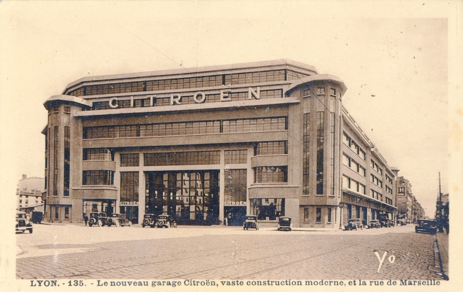

<!--
# Style lead only for this slide
_class: lead
_footer: Algorithmique Avancée et Bibliothèque Graphique - 2022-2023
-->

**ING1** Projet d'informatique

# ECE World

Nintendeau

---

# Equipe Nintendeau

- DALLE Léon
- DE VULPIAN Alfred
- INNOCENT Mathéo
- DEROUICH Shaïma

---

# ECE World

## Thème

- Fête foraine 
- 9 jeux 
- 2 joueurs 
- 1 classement
- 5 tickets par joueur
---

# Carte `1/2`

*Réalisée par : **Léon**, **Alfred**.*

Décrire ici les fonctionnalités implémentées : choix joueurs, saisie des noms, affichage des scores/classement... Comment avez-vous fait ? Quels étaient les problèmes rencontrés.

---

# Carte `2/2`

Suite si ça ne tient pas sur une slide. 

:bulb: *Vous pouvez faire comme ça à chaque fois qu'une slide ne suffit pas, il vaut mieux 5 slides légères qu'une surchargée.*

---

# Organisation des jeux

Les jeux ont tous été enregistrés dans un dossier specialement créé pour eux nommé attractions. Chaque jeu est dans un fichier séparé où l'on retrouve les fonctions principales du jeu, les assets et les CMAKE.

Les jeux prennent en parametres le solde de tickets de chaque joueur et leurs choix de jeux. Ils retournent le solde de tickets de chaque joueur à la fin de la partie.

Pour lancer un jeu, il suffit de se diriger vers une des nombreuses maisons qui sont sur la map,les regles s'afficheront sur un parchemin, il suffira de cliquer sur espace pour executer le jeu.

---

# GUITAR HERO

*Réalisé par : **Alfred** (100%)*

- Il y'a 4 touches (A, Z, E, R) qui correspondent aux 4 cordes de la guitare.
- Les notes tombent du haut de l'écran vers le bas.
- Le joueur doit appuyer sur la touche correspondant à la note au bon moment.
- Si le joueur appuie sur la touche au bon moment, il gagne un point.
- Si le joueur appuie sur la touche au mauvais moment, il perd et donne la main au joueur suivant.

:bulb: Remplacez les images par des captures d'écran de votre jeu.

---

# GUITAR HERO

### Structures

- `struct Note`
    - `int x`
    - `int y`
    - `int vitesse`
    - `int touche`
    - `int estAppuyee`
    - `int estAffichee`

---

### Fonctions

- `void initialiserNotes()`
- `void afficherNotes()`
- `void detecterAppuiTouche()`
- `void afficherScore()`
- `void afficherGagnant()`

### Tableaux

- `struct Note notes[20]`
---

### Graphe d'appel
 

%%{init: {'theme':'neutral'}}%%
flowchart LR
    GuitarHero --> afficherNotes
    GuitarHero --> detecterAppuiTouche
    GuitarHero --> afficherScore
    GuitarHero --> afficherGagnant

 GuitarHero --> initialiserNotes
   

---

# GUITAR HERO

### Logigramme

---

# Paris hippiques

*Réalisé par : **Shaïma** (100%)*

-Le jeu se joue à deux joueurs.
-Il y a 5 tickets par joueur.
-Les 2 joueurs choisissent un cheval chacun.
-Les chevaux se déplacent tous à une vitesse aléatoire.
-Le premier cheval à atteindre la ligne d'arrivée gagne la course et le joueur qui a choisi le cheval gagnant gagne 1 ticket. 

---

# Paris hippiques

### Graphe d'appel

 

%%{init: {'theme':'neutral'}}%%
flowchart LR
    parisHippiques --> initialiserChoixCheval
    initialiserChoixCheval --> positionnerCheval
    parisHippiques --> deplacerChevaux
    deplacerChevaux --> detecterLigneArrivee
    detecterLigneArrivee --> ChevalGagnant
    ChevalGagnant --> afficherGagnant
    afficherGagnant --> afficherScore
    afficherScore --> afficherGagnant

---
# Structures

- `struct Cheval`
    - `int x`
    - `int vitesse`
    - `int xArrivee`
    - `int choixjoueur1,choixjoueur2`

---

# Fonctions

- `int main` (tout  est regroupé dans le main)
- `initialiserChoixCheval()`
- `positionnerCheval()`
- `deplacerChevaux()`
- `InitaliserVitesseAleatoire()`
- `detecterLigneArrivee()`
- `ChevalGagnant()`
- `afficherGagnant()`

---

# Logigramme

---

# Paris hippiques

*Réalisé par : **Léon** (100%)*

-Le jeu se joue à deux joueurs.
-Il y a 5 tickets par joueur.
-Les 2 joueurs se voient attribuer chacun un serpent.
-Le but du jeu est de manger le plus de pommes possible tout en évitant de se mordre la queue, de se prendre un mur ou le corps du serpent adverse.

---

# Snake à 2 joueurs

### Graphe d'appel

 

%%{init: {'theme':'neutral'}}%%
flowchart LR
    snake --> initialiserSerpent
    initialiserSerpent --> afficherSerpent
    snake --> deplacerSerpent
    deplacerSerpent --> detecterCollision
    detecterCollision --> afficherGagnant
    afficherGagnant --> afficherScore
    afficherScore --> afficherGagnant

---
# Structures

- `struct Serpent`
    - `int x`
    - `int y`
    - `int vitesse`
    - `int direction`
    - `int taille`
    - `int estVivant`
    - `int estAffiche`
    - `int estMange`
    - `int estMort`
    

---

# Fonctions

- `void initialiserSerpent()`
- `void afficherSerpent()`
- `void deplacerSerpent()`
- `void detecterCollision()`
- `void afficherGagnant()`
- `void afficherScore()`

---

# Logigramme

---

# Jackpot

*Réalisé par : **Mathéo** (100%)*

- Le jeu se joue à deux joueurs.
- Il y a 5 tickets par joueur.
- A l'aide du bouton START, le joueur lance la machine.
- Les roues tournent et s'arrêtent aléatoirement sur un symbole.
- Si les 3 symboles sont identiques, le joueur gagne 1 ticket.
- Si les 3 symboles sont différents, le joueur perd 1 ticket.

---

# Jackpot

### Graphe d'appel

 

%%{init: {'theme':'neutral'}}%%
flowchart LR
    jackpot --> initialiserJackpot
    initialiserJackpot --> afficherJackpot
    jackpot --> lancerJackpot
    lancerJackpot --> afficherJackpot
    lancerJackpot --> detecterGagnant
    detecterGagnant --> afficherGagnant
    afficherGagnant --> afficherScore
    afficherScore --> afficherGagnant

---
# Structures

- `struct Jackpot`
    - `int x`
    - `int y`
    - `int signe1`
    - `int signe2`
    - `int signe3`
    - `bool estGagnant`

---

# Fonctions

- `int main()` (tout est regroupé dans le main)
- `void initialiserJackpot()`
- `void afficherJackpot()`
- `void lancerJackpot()`
- `void detecterGagnant()`
- `void afficherGagnant()`
- `void afficherScore()`

---

# Logigramme

---

# Snake à 2 joueurs

*Réalisé par : **Léon** (100%)*

-Le jeu se joue à deux joueurs.
-Il y a 5 tickets par joueur.
-Les 2 joueurs se voient attribuer chacun un serpent.
-Le but du jeu est de manger le plus de pommes possible tout en évitant de se mordre la queue, de se prendre un mur ou le corps du serpent adverse.

---

# Snake à 2 joueurs

### Graphe d'appel

 

%%{init: {'theme':'neutral'}}%%
flowchart LR
    snake --> initialiserSerpent
    initialiserSerpent --> afficherSerpent
    snake --> deplacerSerpent
    deplacerSerpent --> detecterCollision
    detecterCollision --> afficherGagnant
    afficherGagnant --> afficherScore
    afficherScore --> afficherGagnant

---
# Structures

- `struct Serpent`
    - `int x`
    - `int y`
    - `int vitesse`
    - `int direction`
    - `int taille`
    - `int estVivant`
    - `int estAffiche`
    - `int estMange`
    - `int estMort`
    

---

# Fonctions

- `void initialiserSerpent()`
- `void afficherSerpent()`
- `void deplacerSerpent()`
- `void detecterCollision()`
- `void afficherGagnant()`
- `void afficherScore()`
---
<!--
_class: lead
-->

# Les slides suivantes ne seront pas présentées oralement lors de la soutenance mais doivent figurer dans la présentation. Nous les survolerons rapidement.

---

# BILAN

## Tâches réalisées (pour chaque membre de l'équipe)

- `✅ 100%` Créer une carte, 2 joueurs et un classement (carte.c)
    - *Pour certains jeux, les regles et les scores ne sont pas affichés mais c'est en route.*
- `✅ 100%` Terminer les 9 jeux (jeu.c)
    - *Tous les jeux sont terminés.*
- `❌ 80%` Relier la carte aux jeux (carte.c)
    - *Les jeux sont reliés à la carte mais l'execution des programmes demeure tres instable (beaucoup de crashs).*

---

# Investissement

Si vous deviez vous répartir des points, comment feriez-vous ?

%%{init: {'theme':'neutral'}}%%
pie showData
    "Shaïma" : 20
    "Mathéo" : 20
    "Léon" : 30
    "Alfred" : 30
    

---

# Récapitulatif des jeux

| Jeu | Avancement | Problèmes / reste |
| --- | --- | --- |
| Paris hippiques | 100% | - |
| Guitar Hero | 100% | - |
| Snake | 100% | - |
| Jackpot | 100% | - |
| Floppybird | 90% | Jeu totalement fonctionnel, seul petit soucis avec la marge de collision entre l'obstacle et l'oiseau  |
| The Maze | -% | pas plus d'infos |
| Tape-taupe | 100% | - |
| Geometry dash | -% | pas plus d'infos |
| Attrape Chat | -% | pas plus d'infos |

<!--
_class: lead
-->
